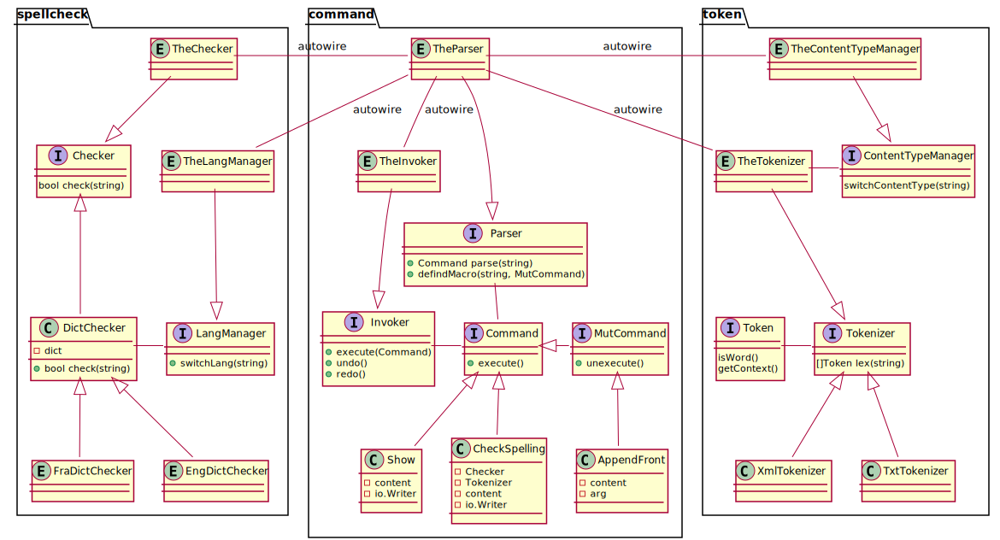

# OOAD lab1
刘乔升 19300200019

## 设计

命令主要分成两类：普通命令`Command`和修改命令`MutCommand`，普通命令实现`execute()`方法，修改命令另外实现了`unexecute()`方法。

`Parser`接口负责命令的解析，`Command parse(string)`方法解析输入，创建命令实例并注入相关依赖（比如`Show`命令实例需要注入当前文本内容`TheContent`和输出流；撤回和重做需要注入命令执行器`TheInvoker`；与拼写检查有关的命令需要注入当前的文本类型解析器`TheTokenizer`和拼写检查器`TheChecker`）。

`Invoker`接口负责命令执行，记忆命令历史，撤回和重做。

与拼写检查有关的有两个package，`token`负责把当前文本内容分解成词素（包含是否为需要检查和内容信息）；`spellchecker`负责检查给定单词是否拼写正确，为了保证单词检查的可扩展性，检查命令依赖的接口是通用的`Checker`。

## 使用Golang的理由

仅说明与面向对象相关的理由。相比传统的面向对象语言Java和C++，Golang提供的是一种“不完整”的面向对象支持：不支持类的继承，仅支持接口的继承。

这种不完整的面向对象在语言层面保证了“组合大于继承”的实践，实际上所有能用类的继承完成的设计都能够用简单类的组合来完成，并且代码结构更加清晰，也规避了开发者的过度设计。
